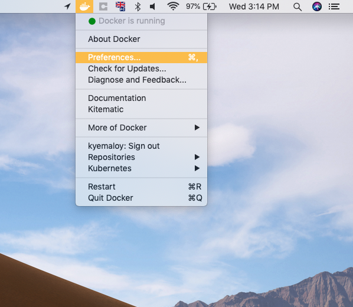
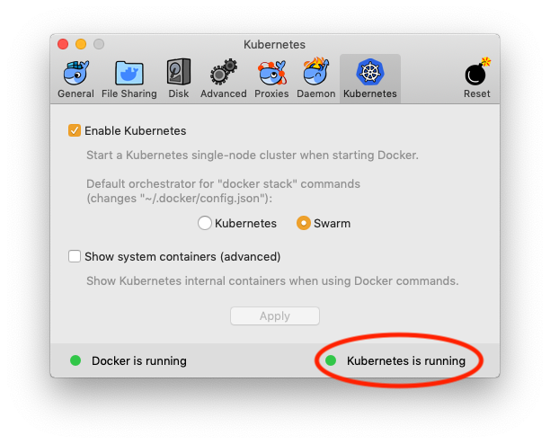
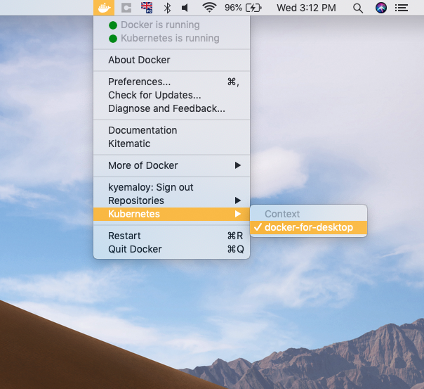

# Kitura "I'm Safe" Lab

<p align="center">

</p>

<p align="center">
<a href= "http://swift-at-ibm-slack.mybluemix.net/">
    
</a>
</p>

## Workshop Table of Contents:

1. [Getting Started](https://github.com/dokun1/kitua-safe-lab/blob/master/README.md)
2. [Setting up the Server](https://github.com/dokun1/kitua-safe-lab/blob/master/ServerSetUp.md)
3. [Setting up the Dashboard](https://github.com/dokun1/kitua-safe-lab/blob/master/DashboardSetUp.md)
4. [Setting up the iOS Client](https://github.com/dokun1/kitua-safe-lab/blob/master/iOSSetUp.md)
5. [Handling Status Reports and Disasters](https://github.com/dokun1/kitua-safe-lab/blob/master/StatusReportsAndDisasters.md)
6. [Setting up OpenAPI and REST API functionality](https://github.com/dokun1/kitua-safe-lab/blob/master/OpenAndRESTAPI.md)
7. **[Build your app into a Docker image and deploy it on Kubernetes](https://github.com/dokun1/kitua-safe-lab/blob/master/DockerAndKubernetes.md)**
8. [Enable monitoring through Prometheus/Grafana](https://github.com/dokun1/kitua-safe-lab/blob/master/PrometheusAndGrafana.md)

# Docker and Kubernetes

Everything we have built so far has run locally on macOS. Using the built in Kubernetes support inside Docker for Desktop, we can deploy to Linux containers instead, using the Helm package manager.

This mimics deploying to a cloud environment such as IBM Cloud, where we would gain support for scaling our app depending on demand, failover to keep our app running smoothly if anything goes wrong, load balancing, rolling updates and more!

## Pre-Requisites

In this section you will learn about:

* Installing Docker for Desktop
* Installing Helm

Ensure you have installed [Docker for Desktop](https://www.docker.com/products/docker-desktop) on your Mac and enabled Kubernetes within the app. To do so, select the Docker icon in the Menu Bar and click `Preferences` > `Kubernetes` Tab > `Enable Kubernetes`. It will take a few moments to install and start up, but when the indicator light in the bottom right corner is green, you're ready to go!





You are also going to need to install Helm using brew. Helm is a package manager for Kubernetes. By installing a Helm "chart" into your Kubernetes cluster you can quickly run all kinds of different applications.

Enter the following into your Terminal:

```bash
brew install kubernetes-helm
```
**Note:** if you get an error at this stage referencing a URL containing `kube`, then you already have Kubernetes installed on your system and are now running with multiple contexts. For the purposes of this workshop, change to the `docker-for-desktop` Kubernetes context by accessing Docker's menubar dropdown (not preferences like before), going into Kubernetes and under context, `select docker-for-desktop`.



## Helm

In this section you will learn about adding repos to Helm.

### Background

Our application is going to consist of one pod (Kubernetes Pods, not CocoaPods). In Kubernetes, a pod is typically one running Docker container, although a pod can contain multiple containers in some more complex scenarios.

We are going to run our pod: which is for our Kitura server

**Note:** A Helm chart `install` to Kubernetes is called a **release**.

### Adding a repository to Helm

Helm has a repository named `stable` which contains lots of commonly used charts (blueprints to things you might want to run in a cluster, like databases!)

We need to tell Helm where to look for these charts.

```bash
helm init #Initialises Helm on our newly created Kubernetes cluster
helm repo add stable https://kubernetes-charts.storage.googleapis.com
```
## Docker

In this section you will learn how to:

- Modify the provided `Dockerfile` and `Dockerfile-tools`
- Create a "build" Docker image for building your application
- Build your Kitura application inside the build image
- Create a run Docker image for running your application
- Tag the run image so it can be installed into Kubernetes

### Modify your Dockerfile and Dockerfile-tools

We are now ready to compile your code and create a Docker image, ready to deploy to Kubernetes. You already have a basic `Dockerfile`, but we need to add the system libraries for our Swift project to use. Open up `Dockerfile` and change the line:

```
# RUN apt-get update && apt-get dist-upgrade -y
```
to the following. Make sure to remove the # comment in front of `RUN`
```dockerfile
RUN sudo apt-get update && apt-get install -y libpq-dev
```

Repeat the same for `Dockerfile-tools`. When you have completed this, we can build our images.

### Building your images

Now we are going to build our Kitura application into a Docker image. This will involve two Docker images: a "build" image and a "run" image. Why are there two? Because it is best practice to make Docker images as small as possible, and while we will need the Swift compiler to build our application, we won't need the compiler to run it!

First we need to build a Docker image to hold our Linux build toolchain. This includes the Linux Swift compiler, along with other components and has a larger storage footprint.

```
docker build -t server-build -f Dockerfile-tools .
```
We now run the build image, which compiles our Kitura application in Docker. This creates the Linux binaries, and saves them to our Mac.
```
docker run -v $PWD:/swift-project -w /swift-project server-build /swift-utils/tools-utils.sh build release
```
Now it's time to build the "run" image containing our compiled Kitura application, but not the Swift compiler etc. This image could then be uploaded to a container registry such as Docker Hub if we wanted to do so.
```
docker build -t server-run .
```
### Tagging your image for use with Helm

Finally, we need to tag the image so we can reference it from our Helm chart.

```bash
docker tag server-run:latest server-run:1.0.0
```

Now our `server-run` Docker image contains our executable which can be deployed to Kubernetes using the Helm chart!

## Deploy with Helm

In this section you will learn about:

- Deploying the Docker container into Kubernetes using a local Helm chart
- Accessing the OpenAPI dashboard from a browser with port forwarding

### Using Helm charts to deploy to Kubernetes

First we must edit the Helm chart to point to our local, tagged `server-run` image. Using Xcode's left sidebar, navigate to `chart` > `kiturasafeserver` > `values.yaml`.

This acts like a blueprint for Helm to use when deploying our application to Kubernetes. We need to modify the `repository`, `tag` and `pullPolicy` lines (towards the top of the file).

**Caution:** make sure your indentation is consistent with the rest of the file, and YAML does not support tabs so use spaces instead!

```yaml
...
image:
    repository: server-run
    tag: 1.0.0
    pullPolicy: IfNotPresent
...
```

We are telling Helm to use a local Docker image called `server-run` tagged at `1.0.0`, and to only pull from a remote if we can't find the image locally.

We are now ready to deploy our Helm chart into Kubernetes.

```bash
helm install --name server chart/kiturasafeserver
kubectl get all #Ensure the pod todoserver-deployment STATUS is Running
```

Now everything is up and running! To access the database, we will use the OpenAPI UI route.

### Accessing the Application from a browser

We can't navigate to `localhost:8080` as usual because our cluster isn't part of the localhost network. Port forwarding is built into the `kubectl` tools, and allows us to access our application from a browser as usual.

```bash
kubectl get pods #Copy the todoserver NAME
kubectl port-forward todoserver-deployment-XXXXXX-XXXXX 8080:8080
```

We can now open a browser, and go to [localhost:8080/openapi/ui](localhost:8080/openapi/ui) where the OpenAPI dashboard should display. Using the drop down menus, select `GET /users` and the response should `200` and the Response Body should contain the connections currently on the server. Kitura is running in Docker under Kubernetes, and accessing the PostgreSQL database running in a separate Docker container!

## Next Steps

Congratulations! We have learnt about Docker, Helm and Kubernetes and deployed our own releases to the local cluster.

Set up [Monitoring in Kubernetes using Prometheus and Grafana](https://github.com/IBM/ToDoBackend/blob/master/MonitoringKube.md).

### Cleaning up

Finally, we will:

- Delete Helm releases
- Delete local Docker images
- Turn off your local Kubernetes cluster

**CAUTION! DO NOT DO THIS IF YOU ARE PROCEEDING TO THE NEXT SECTION, OTHERWISE YOU WILL NEED TO REDEPLOY!**

We have a few things that are taking up disk space, including about 2.4GB of Docker images, as well as a running cluster which is using system resources. To clean up your system, start by deleting the Kitura server from the Kubernetes cluster.

```bash
helm delete --purge server
```

We can now delete our local Docker images from the system to reclaim the lost hard drive space.

```bash
docker image list #We will need the IMAGE ID values
docker image rm -f IMAGE-ID #Repeat on the IMAGE ID of both your run and build images
```

We have now stopped the releases running in the Kubernetes cluster, and deleted their respective Docker images from the system.

The final step is to open up the Docker for Desktop application preferences from the Docker Menubar icon and uncheck the `Enable Kubernetes` box under the `Kubernete`s tab. This stops your local cluster from running.

### Appendix: Tips for Kubernetes and Helm

For live logs from a running pod, use

```
kubectl log --timestamps=true --follow=true <POD-NAME>
```

This will create a streaming output of the logs created by the pod. This works well if you are having issues connecting to the database, for example. You could have logs from the database streaming as you access the todoserver on the port-forwarded port `8080`, and get realtime feedback on what the server is reporting.

To delete an individual deployment created with Helm

```bash
helm list #Note the exact name (same one you chose when you ran helm install)
helm delete --purge RELEASE-NAME
```

Without including `--purge`, the name of the instance is not freed and if you ran `helm install` again using the same name, you could recieve an error.
